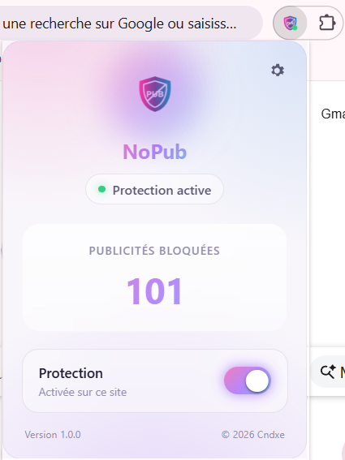
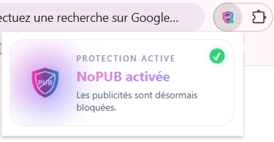

<div align="center">


# NoPUB

**Une extension Chrome légère pour bloquer les publicités et nettoyer les pages web.**

[Installation](INSTALLATION.md) · [Confidentialité](PRIVACY.md) · [Licence](LICENCE.md)

</div>

---

## Présentation

**NoPUB** est une extension Chrome légère et rapide conçue pour réduire les publicités et nettoyer l'affichage des pages web pendant la navigation.

L'extension combine le **blocage de certaines requêtes publicitaires** avec le **nettoyage dynamique des éléments publicitaires présents dans les pages**.

---

## Aperçu

<div align="center">



</div>

> Interface principale de NoPUB avec l'état de la protection et le compteur des éléments supprimés.

<div align="center">



</div>

> Petite popup affichée au lancement de Chrome pour indiquer l'état de l'extension.


---

## Fonctionnalités

* Protection activée par défaut.
* Interrupteur permettant d'activer ou de désactiver le blocage des publicitées.
* Blocage de certaines requêtes provenant de domaines publicitaires connus.
* Suppression de certains éléments publicitaires directement présents dans les pages.
* Compteur des éléments supprimés.
* Interface accessible depuis l'icône NoPUB dans la barre d'outils Chrome.
* Indicateur visuel de l'état de la protection.
* Application immédiate des changements effectués depuis l'interface.
* Paramétrage de la popup depuis la section dédiée aux paramètres.

---

## Comment fonctionne NoPUB ?

NoPUB repose sur deux mécanismes complémentaires.

### 1. Blocage des requêtes

L'extension utilise les mécanismes de filtrage de Chrome afin de bloquer certaines requêtes associées à des domaines publicitaires connus.

### 2. Nettoyage des pages

Un script analyse ensuite le contenu des pages et supprime certains éléments identifiés comme publicitaires à partir de leurs **classes** ou **identifiants HTML**.

---

## Architecture

```text
NoPUB
│
├── README.md
├── background.js
├── INSTALLATION.md
├── LICENCE.md
├── manifest.json
├── PRIVACY.md
│
├── activation
│   ├── activation.css
│   ├── activation.html
│   └── activation.js
│
├── content
│   └── cleaner.js
│
├── popup
│   ├── popup.css
│   ├── popup.html
│   └── popup.js
│
├── rules
   └── ads.json

```

---

## Installation

L'installation de NoPUB peut être effectuée manuellement depuis le code source.

Consulte le guide détaillé :

**[Guide d'installation](INSTALLATION.md)**

---

## Utilisation

Après l'installation :

1. Ouvrez Chrome.
2. Accédez aux extensions.
3. Activez NoPUB.
4. Épinglez l'extension dans la barre d'outils si nécessaire.
5. Cliquez sur l'icône NoPUB pour accéder à l'interface.
6. Activez ou désactivez la protection selon vos besoins.

L'état actuel de la protection est indiqué directement dans l'interface.

---

## Confidentialité

NoPUB a été conçu pour fonctionner directement dans le navigateur.

Pour plus d'informations sur les données utilisées et les pratiques de confidentialité :

**[Consulter la politique de confidentialité](PRIVACY.md)**

---

## Licence

**[LICENCE](LICENCE.md)**

---


